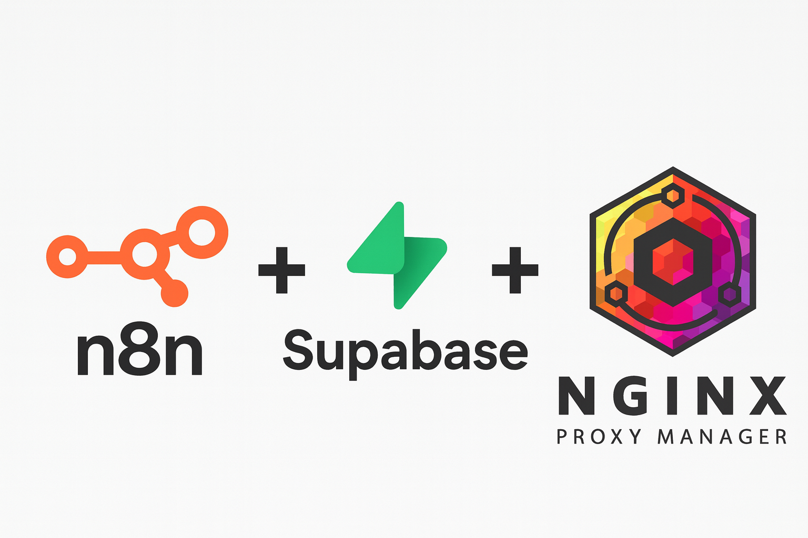
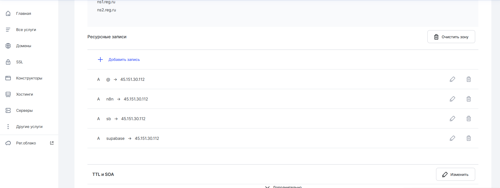

# 🚀 NPM + n8n + Supabase Stack

Полнофункциональный стек для развертывания интегрированной платформы автоматизации с: 
- **Nginx Proxy Manager (NPM)** — обратный прокси с управлением SSL-сертификатами
- **Supabase** — open-source БД + Auth + Storage (PostgreSQL + Kong + Studio)
- **n8n** — платформа визуальной автоматизации рабочих процессов

Все сервисы работают в Docker и взаимодействуют через безопасные Docker-сети с SSL-шифрованием.

## 📋 Архитектура

```
┌─────────────────────────────────────────────────────────────┐
│                    Пользователь                             │
│                   (Интернет 80/443)                         │
└──────────────────────────┬──────────────────────────────────┘
                           │
                           ▼
┌────────────────────────────────────────────────────────────┐
│       Nginx Proxy Manager (npm_default сеть)               │
│  - Порт 80 (HTTP) → 443 (HTTPS)                            │
│  - Управление SSL сертификатами (Let's Encrypt)            │
│  - Admin UI:  : 81                                         │
└──────┬──────────────────────────┬──────────────────────────┘
       │                          │
       ▼                          ▼
┌─────────────────┐    ┌──────────────────────────────────┐
│     n8n         │    │   Supabase (supabase_default)    │
│ : 5678 (внутр.) │    │ - Kong API Gateway : 8000        │
│ Workflows       │    │ - Studio UI :3000                │
│ Webhooks        │────│ - PostgreSQL :5432 (внутренний)  │
└─────────────────┘    │ - PostgREST, GoTrue, Realtime    │
                       │ - Storage, Edge Functions        │
                       └──────────────────────────────────┘
```

**Порядок запуска сервисов критичен:**
1. **npm** — создает Docker-сеть и прокси
2. **supabase-project** — поднимает БД, API, аутентификацию
3. **n8n** — подключается к обеим сетям и может интегрироваться с Supabase

## 🚀 Быстрый старт

### Шаг 1: Клонирование и подготовка
#### На вашем сервере должны быть установлены:
1. Git ```apt-get install git```
2. Docker [инструкция по установке](https://docs.docker.com/engine/install/ubuntu/#install-using-the-repository)
3. OS сервера должна быть Ubuntu

```bash
git clone https://github.com/ITEnthusiast-ru/NPM-n8n-Supabase.git
cd NPM-n8n-Supabase

# Создаем необходимые Docker-сети (используются сервисами)
docker network create npm_default || true
docker network create supabase_default || true
```

### Шаг 2: Настройка переменных окружения и доменов

Любым удобным для вас способом отредактируйте файл docker-compose.yml
#### Для n8n (`n8n/docker-compose.yml`):
```yaml
# Замените yourdomain.ru на ваш реальный домен
environment:
  - N8N_HOST=n8n.yourdomain.ru       # Основной домен для доступа
  - N8N_WEBHOOK_URL=https://n8n.yourdomain.ru  # URL для вебхуков
  - WEBHOOK_URL=https://n8n.yourdomain.ru  
```
так же стоит поступить с файлом переменых окружения .env в папке supabase-project
#### Для Supabase (`supabase-project/.env`):
Это **критически важный файл** — здесь хранятся все секреты: 

```env
# 🔐 ОБЯЗАТЕЛЬНО ЗАМЕНИТЕ ЭТИ ЗНАЧЕНИЯ
POSTGRES_PASSWORD=your-super-secret-and-long-postgres-password
JWT_SECRET=your-super-secret-jwt-token-with-at-least-32-characters-long
ANON_KEY=eyJ...   # Получите/сгенерируйте после первого запуска
SERVICE_ROLE_KEY=eyJ...  # Получите/сгенерируйте после первого запуска

# Доступ к Studio
DASHBOARD_USERNAME=supabase
DASHBOARD_PASSWORD=this_password_is_insecure_and_should_be_updated

# Генерация безопасных значений: 
# JWT_SECRET:  openssl rand -base64 32
# POSTGRES_PASSWORD: openssl rand -base64 16
```

**Где взять ANON_KEY и SERVICE_ROLE_KEY? **

Они генерируются автоматически при первом запуске Supabase.  После запуска контейнеров: 
1. Откройте [документацию supabase](https://supabase.com/docs/guides/self-hosting/docker)
2. Пролистайте до раздела Generate and configure API keys
3. Замените значения JWT_SECRET ANON_KEY SERVICE_ROLE_KEY на соответстующие зачения в `.env` файле
4. Перезапустите контейнер:  `docker-compose restart`

### Шаг 3: Настройка DNS

Добавьте A-записи у вашего DNS-провайдера (или отредактируйте `/etc/hosts` для локального тестирования):


```
npm. yourdomain.ru          → IP_вашего_сервера
n8n.yourdomain. ru          → IP_вашего_сервера
supabase.yourdomain.ru     → IP_вашего_сервера
```

**Локальная разработка (без DNS):**
```bash
# В /etc/hosts (Linux/Mac) или C:\Windows\System32\drivers\etc\hosts (Windows):
127.0.0.1  npm.local
127.0.0.1  n8n.local
127.0.0.1  supabase.local
```

### Шаг 4: Запуск сервисов (правильный порядок ⚠️)

**ВАЖНО:** Запускайте сервисы именно в этом порядке! 

#### 4. 1 Запуск Nginx Proxy Manager
```bash
cd npm
docker-compose up -d
cd .. 

# Проверка
docker logs app  # Container name из docker-compose.yml
# Ожидаем:  "Listening on 0.0.0.0:80" и ": 443"
```

#### 4.2 Запуск Supabase (важное ожидание!)
```bash
cd supabase-project
docker-compose up -d
cd .. 
```
```bash
# Проверка готовности БД (это займет 30-60 секунд!)
docker logs supabase-db --tail 20
# Ищем сообщение: "database system is ready to accept connections"
```
```bash
# Проверка Kong API Gateway
docker logs supabase-kong --tail 10
# Ожидаем, что Kong запустился без ошибок
```

**⏳ Время ожидания Supabase:** 1-2 минуты для полной инициализации БД и всех сервисов. 

#### 4.3 Запуск n8n
```bash
cd n8n
docker-compose up -d
cd ..

# Проверка
docker logs n8n --tail 50
# Ожидаем: "Server is running on..."
```

### Шаг 5: Настройка Nginx Proxy Manager

Откройте **http://ваш-ip:81** в браузере.

**Стандартные учетные данные:**
  - Ведите ваше имя администратора
  - Введите ваш email  администратора
  - Введите пароль

⚠️ **Сразу смените пароль!** (Settings → Users → Change Password)

#### Добавьте три Proxy Host:

**Proxy Host 1 — Nginx Proxy Manager админ-панель:**
- Domain Names: `npm.yourdomain.ru`
- Forward Hostname/IP: `localhost` (или имя контейнера `app`)
- Forward Port: `81`
- SSL Certificate: Create a new SSL Certificate (Let's Encrypt)
- Force SSL: ✓

**Proxy Host 2 — n8n:**
- Domain Names:  `n8n.yourdomain.ru`
- Forward Hostname/IP: `n8n` (имя контейнера в npm_default сети)
- Forward Port: `5678`
- SSL Certificate: Create a new SSL Certificate (Let's Encrypt)
- Force SSL: ✓

**Proxy Host 3 — Supabase Kong Gateway:**
- Domain Names: `supabase.yourdomain.ru`
- Forward Hostname/IP: `supabase-kong` (имя контейнера в supabase_default сети)
- Forward Port: `8000`
- SSL Certificate: Create a new SSL Certificate (Let's Encrypt)
- Force SSL: ✓
  
Еще нужно кое что добавить в каждой конфигурации нажмите на значок шестиренки

  

  и обавьте в Custom Nginx Configuration:

```
client_max_body_size 100M;
proxy_read_timeout 300s;

proxy_set_header Upgrade $http_upgrade;
proxy_set_header Connection "upgrade";
proxy_set_header X-Real-IP $remote_addr;
proxy_set_header X-Forwarded-For $proxy_add_x_forwarded_for;
proxy_set_header X-Forwarded-Proto $scheme;
```

### Шаг 6: Проверка доступности сервисов

```bash
# Все контейнеры должны быть RUNNING
docker ps --format "table {{.Names}}\t{{.Status}}\t{{.Networks}}"
```


Откройте в браузере: 
- **NPM Admin:** https://npm.yourdomain.ru
- **Supabase Studio:** https://supabase.yourdomain.ru
- **n8n:** https://n8n.yourdomain.ru

---

## 📁 Структура проекта

```
NPM-n8n-Supabase/
├── README.md                           # Эта файл
├── npm/
│   ├── docker-compose.yml              # Nginx Proxy Manager конфиг
│   ├── data/                           # Данные NPM (БД, конфиги)
│   └── letsencrypt/                    # SSL сертификаты
├── n8n/
│   ├── docker-compose.yml              # n8n конфиг
│   │   ├── ports:  127.0.0.1:5678       # Только локальный доступ
│   │   ├── networks: [npm_default, supabase_default]
│   │   └── volumes: n8n_data, ./local_files
│   └── local_files/                    # Пользовательские файлы
├── supabase-project/
│   ├── docker-compose.yml              # Полная конфигурация Supabase
│   ├── . env                            # 🔐 СЕКРЕТЫ (заполнить обязательно!)
│   ├── .env.example                    # Шаблон переменных
│   ├── volumes/
│   │   ├── db/                         # PostgreSQL данные
│   │   ├── storage/                    # Файлы пользователей
│   │   └── pooler/                     # Конфиг Supavisor (connection pooler)
│   ├── dev/
│   │   ├── data. sql                    # Пример SQL:  таблицы, RLS политики
│   │   └── docker-compose.dev.yml      # Dev окружение (опционально)
│   ├── CHANGELOG.md                    # История обновлений сервисов
│   ├── versions. md                     # Версии Docker образов
│   ├── reset. sh                        # Скрипт для полного сброса
│   └── README.md                       # Документация Supabase
└── supabase/                           # Дополнительная документация Supabase

```


---

## 🔐 Безопасность

### Критические шаги ⚠️

1. **Замените все секреты в `supabase-project/.env`** перед production: 
   - `POSTGRES_PASSWORD` — сложный пароль (20+ символов, буквы+цифры+спецсимволы)
   - `JWT_SECRET` — генерируется `openssl rand -base64 32`
   - `DASHBOARD_PASSWORD` — сильный пароль для Supabase Studio

2. **Смените пароль администратора NPM** сразу после первого входа:
   - Откройте NPM Admin:  https://npm.yourdomain.ru
   - Settings → Users → Change Password

3. **Не открывайте внутренние порты в Интернет:**
   - ❌ 5432 (PostgreSQL)
   - ❌ 8000 (Kong gateway — используйте NPM)
   - ❌ 3000 (Supabase Studio — используйте NPM)
   - ❌ 5678 (n8n — используйте NPM)

4. **Используйте SSL/HTTPS везде:**
   ```bash
   # Проверка, что все прокси используют SSL
   # В NPM Admin → Proxy Hosts → каждый должен иметь SSL Certificate
   ```

### Проверка безопасности

```bash
# Убедиться, что внутренние порты закрыты (пример для Linux)
sudo ss -tulpn | grep -E ': 5432|:8000|:3000|:5678' || echo "✓ Все внутренние порты закрыты"
```

```bash
# Проверить Docker-сети (n8n должна быть в обеих сетях)
docker inspect n8n | jq '.[0].NetworkSettings.Networks'
```


```bash
# Проверить логи на ошибки безопасности
docker logs supabase-db | grep -i "error\|fail" || echo "✓ Нет ошибок"
```

---

## 🛠️ Управление и обслуживание

### Мониторинг статуса

```bash
# Быстрый статус всех контейнеров
docker ps --format "table {{.Names}}\t{{.Status}}\t{{.Ports}}"

# Детальная информация о сети
docker network inspect npm_default
docker network inspect supabase_default

# Проверка использования ресурсов
docker stats --no-stream

# Объем занимаемого места
docker system df
```

### Просмотр логов

```bash
# Логи NPM
docker logs npm-app-1 -f --tail 50

# Логи Supabase (выбранный сервис)
docker logs supabase-db -f --tail 100
docker logs supabase-kong -f --tail 50
docker logs supabase-studio -f --tail 50

# Логи n8n
docker logs n8n -f --tail 100

```

### Обновление образов

```bash
# Проверка наличия новых версий образов
docker-compose pull

# Для каждого сервиса: 
# 1. Остановить
# 2. Скачать новый образ
# 3. Стартовать

# NPM
cd npm
docker-compose pull
docker-compose down
docker-compose up -d
cd ..

# Supabase (важно:  сначала прочитайте CHANGELOG. md!)
cd supabase-project
cat CHANGELOG.md  # Проверьте breaking changes
docker-compose pull
docker-compose down
docker-compose up -d
# Подождите, пока БД инициализируется
sleep 60
cd .. 

# n8n
cd n8n
docker-compose pull
docker-compose down
docker-compose up -d
cd ..
```

### Резервное копирование

#### Backup Supabase (базы данных)
```bash
# Полный дамп PostgreSQL
docker exec supabase-db pg_dumpall -U postgres > backup_$(date +%Y%m%d_%H%M%S).sql

# Только таблицы (без системных данных)
docker exec supabase-db pg_dump -U postgres postgres > backup_tables_$(date +%Y%m%d_%H%M%S).sql

# Восстановление из бэкапа
docker exec -i supabase-db psql -U postgres < backup_YYYYMMDD_HHMMSS.sql
```

#### Backup n8n (workflows и данные)
```bash
# Архив данных n8n
docker exec n8n tar czf - /home/node/.n8n > n8n_backup_$(date +%Y%m%d_%H%M%S).tar.gz

# Восстановление
docker cp n8n_backup_YYYYMMDD_HHMMSS.tar.gz n8n:/tmp/
docker exec n8n tar xzf /tmp/n8n_backup_YYYYMMDD_HHMMSS.tar.gz -C /
```

#### Backup Storage (Supabase файлы)
```bash
# Архив хранилища
docker cp supabase-storage:/var/lib/docker/volumes/supabase_storage_data supabase_storage_backup_$(date +%Y%m%d)
```

#### Скрипт полного резервного копирования

```bash
#!/bin/bash
BACKUP_DIR="./backups/$(date +%Y-%m-%d_%H-%M-%S)"
mkdir -p "$BACKUP_DIR"

echo "📦 Backup Supabase DB..."
docker exec supabase-db pg_dumpall -U postgres > "$BACKUP_DIR/postgres_full. sql"

echo "📦 Backup n8n data..."
docker exec n8n tar czf - /home/node/.n8n > "$BACKUP_DIR/n8n_data. tar.gz"

echo "📦 Backup конфигов..."
cp supabase-project/.env "$BACKUP_DIR/supabase. env"
cp n8n/docker-compose.yml "$BACKUP_DIR/n8n_docker-compose.yml"

echo "✅ Backup готов:  $BACKUP_DIR"
```

### Полный сброс (если что-то сломалось)

```bash
# ⚠️ ВНИМАНИЕ: Это удалит ВСЕ данные! 

# 1. Остановить все контейнеры
docker-compose -f npm/docker-compose.yml down
docker-compose -f supabase-project/docker-compose.yml down -v  # -v удаляет volumes! 
docker-compose -f n8n/docker-compose.yml down -v

# 2. Или использовать встроенный скрипт Supabase
cd supabase-project
bash reset. sh
cd ..

# 3. Удалить сети (если нужно пересоздать)
docker network rm npm_default supabase_default || true

# 4. Начать заново (шаги 1-6 выше)
```

---

## 🐛 Устранение проблем

### 502 Bad Gateway / Connection Refused

**Причина:** Контейнер не запущен или неправильная конфигурация сети в NPM.

```bash
# 1. Проверить, запущены ли контейнеры
docker ps | grep -E "n8n|kong|app"

# 2. Если контейнер упал, смотреть логи
docker logs n8n
docker logs supabase-kong

# 3. Проверить, что контейнер в правильной сети
docker inspect n8n | jq '.NetworkSettings.Networks'
# Должны быть обе сети:  npm_default и supabase_default

# 4. Проверить доступность контейнера из NPM контейнера
docker exec app curl -I http://n8n: 5678
docker exec app curl -I http://supabase-kong:8000
```

### SSL Certificate ошибки

**Проблема:** "Unable to verify the first certificate" или "NET::ERR_CERT_AUTHORITY_INVALID"

```bash
# 1. Проверить, что DNS правильно разрешается
nslookup n8n.yourdomain.ru
# Должен вернуть IP вашего сервера

# 2. В NPM Admin проверить Proxy Host
# - Domain должна быть правильная
# - SSL Certificate должен быть Let's Encrypt
# - Если старый сертификат, удалить и создать новый

# 3. Очистить кэш Let's Encrypt
docker exec app rm -rf /etc/letsencrypt/renewal/n8n.yourdomain. ru. conf
docker exec app nginx -s reload

# 4. Пересоздать сертификат в NPM UI
```

### Supabase не запускается

**Логи показывают ошибки в PostgreSQL:**

```bash
docker logs supabase-db --tail 100

# Частые проблемы:
# - "failed to initialize the database directory" → удалить volumes и пересоздать
# - "port 5432 already in use" → другой Postgres запущен, остановить его
# - "password authentication failed" → проверить POSTGRES_PASSWORD в .env
```

**Решение:**

```bash
# 1. Остановить Supabase
cd supabase-project
docker-compose down -v

# 2. Очистить данные
rm -rf volumes/db/data/*

# 3. Перепроверить . env (особенно пароли!)
nano .env

# 4. Запустить снова
docker-compose up -d
docker logs supabase-db -f  # Ждать "ready to accept connections"
```

### n8n не может подключиться к Supabase

**Ошибка в n8n workflow:** "Cannot reach supabase-kong" или connection timeout

```bash
# 1. Проверить, что Supabase запущена
docker ps | grep supabase

# 2. Проверить доступность из n8n контейнера
docker exec n8n curl -I http://supabase-kong:8000
# Должен вернуть HTTP 200 или 404 (но не connection refused)

# 3. Проверить, что n8n в supabase_default сети
docker inspect n8n | jq '.NetworkSettings.Networks'

# 4. Если нет supabase_default сети, добавить: 
docker network connect supabase_default n8n
docker restart n8n
```

### Out of Memory или High CPU

**Контейнеры потребляют много ресурсов:**

```bash
docker stats --no-stream

# Решения:
# - Для Supabase: увеличить лимиты памяти в docker-compose.yml
# - Для n8n: ограничить количество одновременных executions
# - Очистить старые executions/logs в n8n
```

---

## 📚 Примеры использования

### Пример 1: Создание первого workflow в n8n с Supabase

1. Откройте **https://n8n.yourdomain.ru**
2. Создайте новый workflow: **New → Workflow**
3. Добавьте узел:  **+ → HTTP Request**
4. Конфигурация:
   ```
   Method: POST
   URL: https://supabase.yourdomain.ru/rest/v1/profiles
   Headers: 
     - Key: Authorization
       Value: Bearer [ваш ANON_KEY]
     - Key: Content-Type
       Value: application/json
   Body:
     {
       "id": "user-id",
       "username": "test_user",
       "avatar_url": "https://..."
     }
   ```
5. Нажмите Execute
6. Если статус 201 Created — успешно!  ✓

### Пример 2: RLS политики в Supabase

Файл `supabase-project/dev/data. sql` содержит примеры: 

```sql
-- Таблица profiles с Row Level Security
create table profiles (
  id uuid references auth.users not null primary key,
  updated_at timestamp with time zone,
  username text unique,
  avatar_url text,
  website text
);

-- Политика:  пользователь видит только свой профиль
create policy "Public profiles are viewable by the owner."
  on profiles for select
  using ( auth.uid() = id );
```

Чтобы применить эти примеры: 
```bash
# 1. Откройте SQL Editor в Supabase Studio
# 2. Скопируйте содержимое dev/data.sql
# 3. Выполните запросы
```

### Пример 3: Edge Function в Supabase

Файл `supabase-project/volumes/functions/main/index.ts` — пример функции:

```typescript
// Простая функция на TypeScript/Deno
import { serve } from 'https://deno.land/std@0.131.0/http/server.ts'

serve(async (req:  Request) => {
  const data = await req.json()
  
  return new Response(
    JSON.stringify({ message: 'Hello ' + data.name }),
    { headers: { 'Content-Type': 'application/json' } }
  )
})
```

Вызов из n8n:
```
POST https://supabase.yourdomain.ru/functions/v1/main
Header: Authorization: Bearer SERVICE_ROLE_KEY
Body: {"name":  "John"}
```

---

## 📖 Основные команды

```bash
# Общие команды Docker
docker ps                                    # Список запущенных контейнеров
docker logs <container_name> -f              # Логи контейнера (follow mode)
docker exec <container_name> <command>       # Выполнить команду в контейнере
docker-compose ps                            # Статус сервисов в текущей папке
docker-compose logs -f                       # Логи всех сервисов

# Управление сервисами
docker-compose up -d                         # Запустить в фоне
docker-compose down                          # Остановить контейнеры
docker-compose down -v                       # Остановить и удалить volumes (⚠️ данные!)
docker-compose restart                       # Перезагрузить контейнеры
docker-compose pull                          # Скачать новые образы

# Сети
docker network ls                            # Список сетей
docker network inspect <network_name>        # Информация о сети
docker network connect <network> <container> # Подключить контейнер к сети

# Volumes и данные
docker volume ls                             # Список volumes
docker volume inspect <volume_name>          # Информация о volume
docker volume rm <volume_name>               # Удалить volume
```

---

## 🔗 Полезные ссылки

- **Supabase Документация:** https://supabase.com/docs
- **n8n Документация:** https://docs.n8n.io
- **Nginx Proxy Manager:** https://nginxproxymanager.com/setup
- **Docker Compose Reference:** https://docs.docker.com/compose/compose-file/
- **PostgreSQL:** https://www.postgresql.org/docs/current/

---

## 📝 Лицензия

MIT

---

## ❓ Часто задаваемые вопросы

**Q: Могу ли я запустить это на Windows/Mac? **  
A: Да, Docker работает везде.  Используйте Docker Desktop.  Просто замените пути в docker-compose (Windows использует `\`, Linux/Mac используют `/`).

**Q: Что делать, если забыл пароль администратора Supabase?**  
A: Используйте `supabase-project/reset.sh` для полного сброса или отредактируйте `.env` с новым паролем и перезагрузите.

**Q:  Как масштабировать Supabase?**  
A: На одном сервере максимум определяется ресурсами.  Для production используйте облачное Supabase (supabase.com).

**Q: Могу ли я использовать MySQL вместо PostgreSQL?**  
A: Нет, Supabase использует только PostgreSQL.  Это одна из её основных особенностей.

**Q: Сколько места занимает полный стек? **  
A: ~3-5 GB дискового пространства для образов Docker, +данные БД.  Памяти:  минимум 2 GB, рекомендуется 4+ GB.
